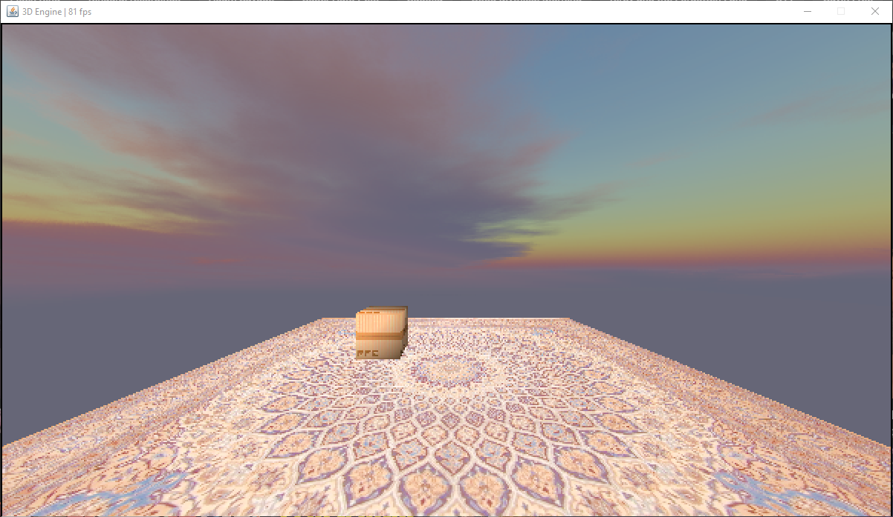

# java-3d-rendering-engine
A 3d rendering engine written in Java that is loosely based on javidx9's 3D rendering YouTube tutorial written in C++. 
This is the second version of this rendering engine. The first version was web based and written in Javascript.

## Table of contents
* [General info](#general-info)
* [Quck Links](#quick-links)
* [Languages](#languages)
* [Inspiration / Credits](#inspiration)
* [Images](#visuals)

## General info
The camera's position is controlled using the 'WASD' keys and the rotation is controlled using the arrow keys. The camera can be rolled using the 'Q' and 'R' keys. Its position and rotation can be reset using the 'X' key.

### Quick Links
These are links to resources I am using to develop the project.
* https://www.scss.tcd.ie/~manzkem/CS7057/cs7057-1516-09-CollisionResponse-mm.pdf
* https://math.stackexchange.com/questions/2282938/converting-from-quaternion-to-angular-velocity-then-back-to-quaternion#:~:text=Note%20that%202Imq,∗¯q(t).
* https://chrishecker.com/Rigid_Body_Dynamics

### Languages
* Java

## Inspiration / Credits
These youtube channels helped guide me through this project
* [javidx9](https://www.youtube.com/channel/UC-yuWVUplUJZvieEligKBkA) (OneLoneCoder)
* [The Coding Train](https://www.youtube.com/channel/UCvjgXvBlbQiydffZU7m1_aw)

## Images

This is a screenshot of a textured cube next to a flat shaded octahedron.

 

This is a screenshot of Suzanne, blender's version of the utah teapot.

 

This is a screenshot of the skybox and textured objects.

 

